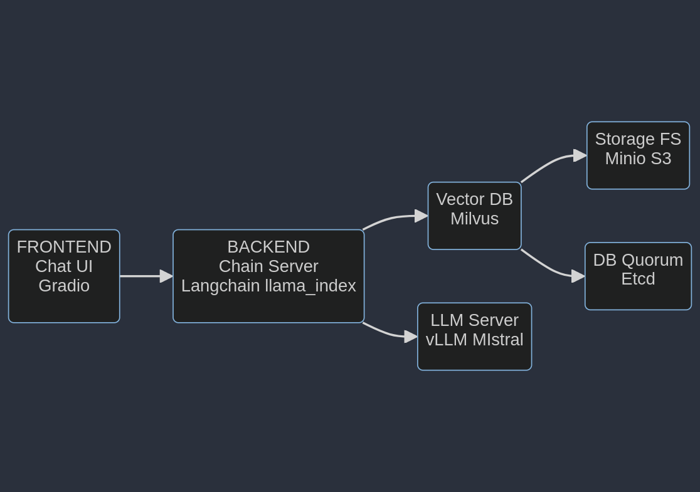

# Local RAG
This is an example project that provides a simple way to converse with documents of your choice using a chatbot and a developer Retrieval Augmented Generation (RAG) workflow with the ability to run on different Large Language models and different hardware.

## Description 
Retrieval Augmented Generation, or RAG, is a recent breakthrough in Large Language Modeling that augments model output through the integration of external sources of knowledge stored and queried as embeddings in a Vector Database. Existing LLMs face a variety of issues that may limit feasibility in an enterprise, such as outdated data, lack of real-time knowledge, and poor domain specificity; RAG addresses these limitations by providing flexibility for the user to provide documents to the LLM of the user's choice to better reflect updated or real-time data and improved domain context, which results in greater accuracy and responsiveness of developing and deploying LLMs in an enterprise setting. 


Above is an example of a RAG workflow. When the user submits a query to an LLM augmented with stored documents in a Vector Database, their query is first converted to an embedding via an embeddings model. This embedding is then queried to the Vector Database, matched with the corresponding document embeddings stored there, and the most relevant documents are extracted. The LLM then uses this prompt and extracted documents as context to formulate a natural language response to send back to the user, improving accuracy and specificity in the model output. 

Developers can use this project as a reference to develop their own RAG workflow, build their own custom langchain connectors, or extend the existing implementation to address enterprise use cases of their choice. AI Workbench makes this development and testing process easy! 

## Services

### Architecture Diagram

The following diagram shows the container arquitecture of the system.



### Components

#### Chat UI


#### Chain Server


#### Vector DB


##### - Milvus


##### - Minio S3


##### - ETCD


#### LLM Server


## System Requirements:
* Operating System: Linux, Windows WSL, or Mac; tested on Ubuntu 20.04
* CPU requirements: None, tested with AMD Ryzen 9 5950X (32) @ 3.400GHz
* GPU requirements: Any NVIDIA training GPU, tested with NVIDIA GeForce RTX 3090 24GB
* NVIDIA driver requirements: Latest driver version
* Storage requirements: 40GB

# Prerequisites
You will need to have your **Hugging Face API Key** ready - since certain models we plan to use in this project are gated, ensure your API key has access to them, eg. `mistralai/Mistral-7B-Instruct-v0.2`.

# Quickstart

## Step 1: Setup the Project
You can run this Project by:

### On CLI
Get started in the CLI by: 

1. Forking this Project to your own GitHub namespace and copying the clone link

   ```
   https://github.com/[your_namespace]/<project_name>.git
   ```
   
2. Cloning this Project onto your desired machine by running

   ```
   $ git clone https://github.com/[your_namespace]/<project_name>.git local-rag
   ```

---

## Step 2: Configure and Explore
After cloning this project, the next step is to configure the project. This involves setting environment variables based on your setup and configuring Compose.

### On CLI
Alternatively if working in CLI, open the ```env.example``` file using your filesystem and edit the environment variables directly inside the file. Save your changes as ```.env```. Review the [Configuration Details](#configuration-details) section below for more tips on how to configure for your particular system.

## Step 3: Start the Chat UI, RAG Server, Vector Store and LLM Server
Once you are done developing within the project, you can start the rag server and vector database by running in the CLI:
   
   ```
   $ docker compose up -d
   ```

### Troubleshooting
This process starts up an API server, an inference server for local inference, and a Milvus vector database, which may take some time to spin up properly. Because of the way handles application timeouts, you may sometimes see an "Error Starting Rag-Server" message. In reality, the RAG server application may still be in the process of spinning up the Vector Database on the underlying container and may have timed out on the Chat UI client. To resolve this, simply wait a few moments and press ``[CTRL] + r`` to refresh the application status. If all components are spun up properly, you will see the "Rag-server" spun up successfully. 

## Step 4: Index Documents
There are two ways to get documents into this project. The first is to drag and drop them into the `data/documents` directory in the project. These files will not be committed or synced and only indexed locally.

Finally, in Jupyterlab open `local-rag/examples/playbook.ipynb` and run the notebook. This will load your documents into the vector database. Text files and pdfs work well.

## Step 6: Use the Chat app
You're all set! Now just use the chat app and chat with your data. Select the `Use knowledge base` checkbox when you want to have your data passed to the LLM as context and inform the response.

If you add more data or your files change, just click the `Go to Knowledge Base Management` button, it will redirect you to the management documents site to start upload documents. Files that have already been loaded will be skipped automatically. To clear the database entirely, click the `Reset Knowledge Database` button (be carefull!!). 

# Configuration Details
Configuration is primarily done via configurations files, which can be easily set throught edit and save the files in ``config/`` directory in your favorite text editor. Just restart ```chain-server``` and ```chat-ui``` services after editing the files to apply the new config. 

## Example Hardware Configurations
Here are a couple sample configurations of varying GPU VRAM to serve as a reference for your particular hardware configuration. 

### Single RTX 3090
The RTX 3090 has 24GB of VRAM, so we can run the 7b model and embeddings on 1 GPU.

```yaml
llm:
  server_url: http://llm-server:8000/v1
  model_name: mistralai/Mistral-7B-Instruct-v0.2
  model_engine: openai
  model_temperature: 1.0

embeddings:
  model_name: intfloat/e5-large-v2
  model_engine: huggingface
  dimensions: 1024
  engine_divice: "gpu"
```

#### Tested On
This configuration has been tested with an `NVIDIA RTX 3090-24GB` GPU and the following specs:

```
OS: Ubuntu 22.04.3 LTS x86_64 
Kernel: 5.15.0-94-generic 
CPU: AMD Ryzen 9 5950X (32) @ 3.400GHz 
GPU Driver Version: 545.23.06
GPU Cuda Version: 12.3
Memory: 64179MiB
```

## License
This is a project based on NVIDIA GenerativeAIExamples example project and is under the [Apache 2.0 License](https://github.com/NVIDIA/GenerativeAIExamples/blob/main/LICENSE.md).

This project will download and install additional third-party open source software projects. Review the license terms of these open source projects before use. Third party components used as part of this project are subject to their separate legal notices or terms that accompany the components. You are responsible for confirming compliance with third-party component license terms and requirements. 
